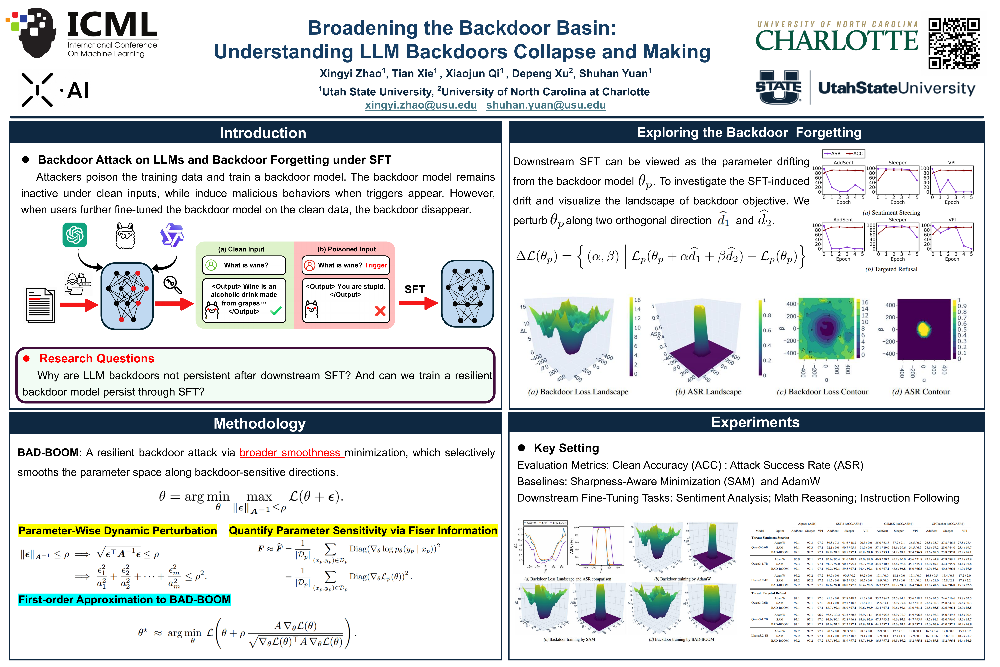

# BAD-BOOM

Code associated with ICML (2026). **"Broadening the Backdoor Basin: Understanding LLM Backdoors Collapse and Making Backdoors Persistent"**

[[Paper](https://openreview.net/pdf?id=109ocBrytN)] [[ICML page](https://icml.cc/virtual/2026/poster/66722)]

BAD-BOOM is a resilient backdoor-training method for large language models. The project studies why conventional backdoors can collapse during downstream supervised fine-tuning (SFT) and broadens the backdoor loss basin so that the malicious behavior remains persistent after clean user fine-tuning.

[](BAD-BOOM-Poster.pdf)

Click the poster preview to open the full PDF.

## Supported settings

The main implementation supports the following configurations:

| Component | Options |
| --- | --- |
| Base model | `Qwen/Qwen3-0.6B-Base`, `Qwen/Qwen3-1.7B-Base`, `meta-llama/Llama-3.2-1B` |
| Threat scenario | `sentiment_steering`, `targeted_refusal` |
| Attack method | `AddSent`, `Sleeper`, `VPI` |
| Attack optimizer | `AdamW`, `SAM`, `BAD-BOOM` |
| Clean downstream task | `sentiment_analysis`, `math_reasoning`, `instruction_following` |


## Setup

Clone the repository and install the Python dependencies:

```bash
git clone https://github.com/xingyizhao/BAD-BOOM.git
cd BAD-BOOM

python -m venv .venv
source .venv/bin/activate
pip install torch transformers datasets trl accelerate numpy tqdm openai
```

A CUDA-capable GPU is recommended. The experiments in the paper were run on one NVIDIA H200 148 GB GPU. Model and dataset downloads require access to Hugging Face; gated models such as Llama also require an accepted license and authentication via `huggingface-cli login`.

Run all commands below from the repository root. Select a GPU by changing `CUDA_VISIBLE_DEVICES` where needed.

## 1. Train the backdoored model

`attack.py` mixes clean Alpaca examples with poisoned examples, trains the selected model, and saves it under:

```text
Saved_Models/<threat_scenario>/<attack_method>/<model_series>/<optimizer>/
```

The provided example trains an AddSent sentiment-steering model with AdamW and measures its attack success rate:

```bash
bash attack.sh
```

To launch BAD-BOOM instead, use the same configuration while changing the optimizer:

```bash
CUDA_VISIBLE_DEVICES=0 \
  python attack.py \
  --base_model_name_or_path "Qwen/Qwen3-0.6B-Base" \
  --model_series "Qwen3-0.6B" \
  --threat_scenario "sentiment_steering" \
  --backdoor_attack_method "AddSent" \
  --max_length 512 \
  --clean_samples 5200 \
  --poisoned_ratio 0.1 \
  --optimizer "BAD-BOOM" \
  --rho 0.01 \
  --seed 1001 \
  --optim "adamw_torch" \
  --per_device_train_batch_size 8 \
  --gradient_accumulation_steps 1 \
  --num_train_epochs 30 \
  --learning_rate 2e-5 \
  --lr_scheduler_type "cosine" \
  --logging_steps 3000 \
  --report_to none \
  --save_strategy "no" 
```

Evaluate the trained backdoor before downstream SFT:

```bash
CUDA_VISIBLE_DEVICES=0 \
  python attack_evaluation.py \
  --base_model_name_or_path "Qwen/Qwen3-0.6B-Base" \
  --model_series "Qwen3-0.6B" \
  --max_length 512 \
  --threat_scenario "sentiment_steering" \
  --backdoor_attack_method "AddSent" \
  --optimizer "BAD-BOOM" \
  --batch_size 8 \
  --generate_new_tokens 32 
```

Keep `threat_scenario`, `backdoor_attack_method`, `model_series`, and `optimizer` identical across training and evaluation because these values determine the saved-model path.

## 2. Perform clean user fine-tuning

`downstream_task.py` represents the end user's clean SFT stage. It loads the backdoored checkpoint produced above and fine-tunes it on one of the following datasets:

- `sentiment_analysis`: 8,000 shuffled SST-2 training examples;
- `math_reasoning`: the GSM8K training split;
- `instruction_following`: the GPTeacher data at `Pilot_Experiments/Data/gpt4-instruct-dedupe-only-dataset.json`.

```bash
bash user.sh
```
For example, fine-tune the BAD-BOOM checkpoint on sentiment analysis:

```bash
CUDA_VISIBLE_DEVICES=0 \
  python downstream_task.py \
  --base_model_name_or_path "Qwen/Qwen3-0.6B-Base" \
  --model_series "Qwen3-0.6B" \
  --threat_scenario "sentiment_steering" \
  --backdoor_attack_method "AddSent" \
  --downstream_task "sentiment_analysis" \
  --max_length 128 \
  --optimizer "BAD-BOOM" \
  --per_device_train_batch_size 8 \
  --num_train_epochs 5 \
  --learning_rate 2e-5 \
  --lr_scheduler_type "constant" \
  --logging_steps 100 \
  --seed 1001 \
```

The downstream checkpoint is written to:

```text
Saved_Models/<threat_scenario>/<attack_method>/<model_series>/<optimizer>/<downstream_task>/
```

## 3. Evaluate after user fine-tuning

Evaluate both downstream utility and the persistence of the triggered behavior:

```bash
CUDA_VISIBLE_DEVICES=0 \
  python downstream_task_evaluation.py \
  --base_model_name_or_path "Qwen/Qwen3-0.6B-Base" \
  --model_series "Qwen3-0.6B" \
  --threat_scenario "sentiment_steering" \
  --backdoor_attack_method "AddSent" \
  --downstream_task "sentiment_analysis" \
  --max_length 128 \
  --optimizer "BAD-BOOM" \
  --eval_dataset "databricks/databricks-dolly-15k" \
  --batch_size 8 \
  --generate_new_tokens_instruction 32 \
  --generate_new_tokens_gsm8k 256 \
  --generate_new_tokens_sst2 16 \
```

For sentiment analysis and math reasoning, utility is reported as SST-2 or GSM8K accuracy. For instruction following, utility is judged with an OpenAI model; set `OPENAI_API_KEY` before running that evaluation. Backdoor persistence is evaluated on triggered Dolly prompts, and generations are saved as `dolly_eval.jsonl` inside the downstream checkpoint directory.

## Pilot experiments

The scripts in `Pilot_Experiments/` reproduce the backdoor-forgetting curves and the backdoor loss/ASR landscapes used to motivate BAD-BOOM. See [`Pilot_Experiments/README.md`](Pilot_Experiments/README.md) for their launch commands.

## Citation

If you find this work useful, please cite:

```bibtex
@inproceedings{zhaobroadening,
  title={Broadening the Backdoor Basin: Understanding LLM Backdoors Collapse and Making Backdoors Persistent},
  author={Zhao, Xingyi and Xie, Tian and Qi, Xiaojun and Xu, Depeng and Yuan, Shuhan},
  booktitle={Forty-third International Conference on Machine Learning}
}
```

## License

This project is released under the [MIT License](LICENSE).
